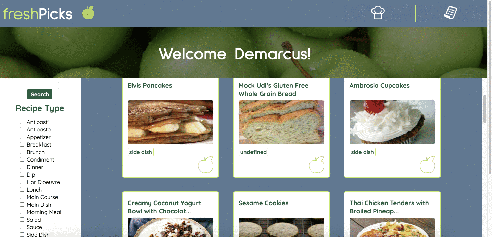
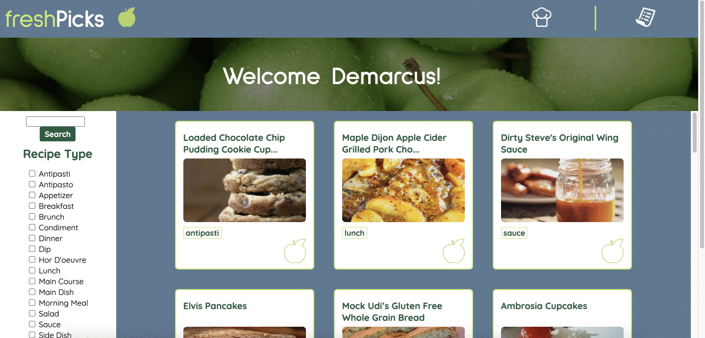

# Refactor Tractor: What's Cookin'

# Leaving the boilerplate in temporarily, we need to remove it before we turn the project in.

## Abstract
This is the group project from the Turing School of Software and Design's Mod 2. For this project, we were given a repository with a preexisting codebase for another project, which we were to build on and refactor. The learning goals for the project were as follows:
- Build on top of pre-existing code that you did not write and navigate someone else’s codebase
- Develop processes for working remotely and submitting pull requests to perform effective code reviews that help ensure the code is accurate and that everyone understands it
- Make network requests to API endpoints to retrieve and manipulate data
- Refactor pre-existing code and use inheritance to DRY up repetitive logic
- Ensure your app is following best practices for accessibility
- Leverage Sass to DRY up your CSS
- Incorporate Webpack to streamline your workflow process
- Leverage Chai Spies to verify that your DOM manipulation is happening

## Setup

# not sure what to put here!

## Contributors

- Joe Haefling: https://github.com/Josephhaefling
- Horacio Borrego: https://github.com/H-Bo214
- Liliana Weimer: https://github.com/lilianaweimer

## Technologies Used

- HTML
- CSS/SCSS/Sass
- Vanilla Javascript
- Git/GitHub
- Webpack
- Fetch API

## In Action

Viewing a recipe

Favoriting a recipe

Accessing the pantry

Filtering recipes by type